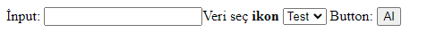

# everything & Her Şey

_Bu proje kapsamın da pek çok form elementini tek bir çatı altından kullanarak yönetmiyi kolaylaştırmayı hedeflemekteyim_

### Kütüphaneyi projenize dahil etmek için

```
git clone https://github.com/HakanKorkz/everything.git 
```

Projenize Dahil etmek için kütüphaneyi 

Composer Kullanıyorsanız

```php
use app\elements\element;

require_once __DIR__."/app/elements/element.php";
```
Veya Kullanmıyorsanız

```php
use app\elements\element;

require_once __DIR__."/vendor/autoload.php";
```

Kullanımı Aşağı da ki örnekte ki gibidir..

```php
echo element::FormStart(["action"=>"","method"=>"post","id"=>"test"]);

echo element::Input(["type"=>"text","name"=>"test","id"=>"test"]);

echo element::Select(["type"=>"text","name"=>"test","id"=>"test2"],["type"=>"text","name"=>"test","id"=>"test"]);

echo element::Button("Al",["type"=>"submit","name"=>"test","id"=>"test"]);

echo element::FormEnd();
```

Çıktısı



